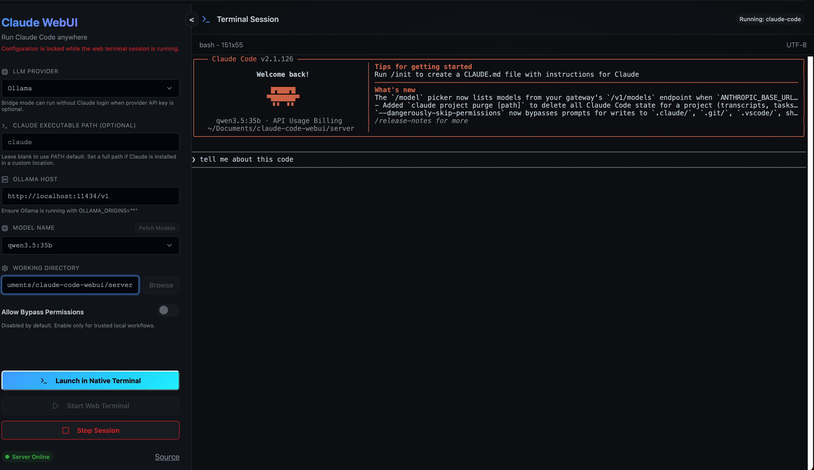
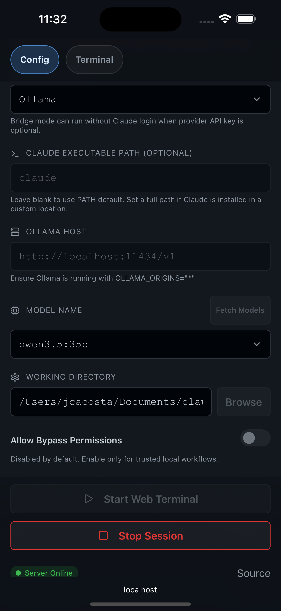
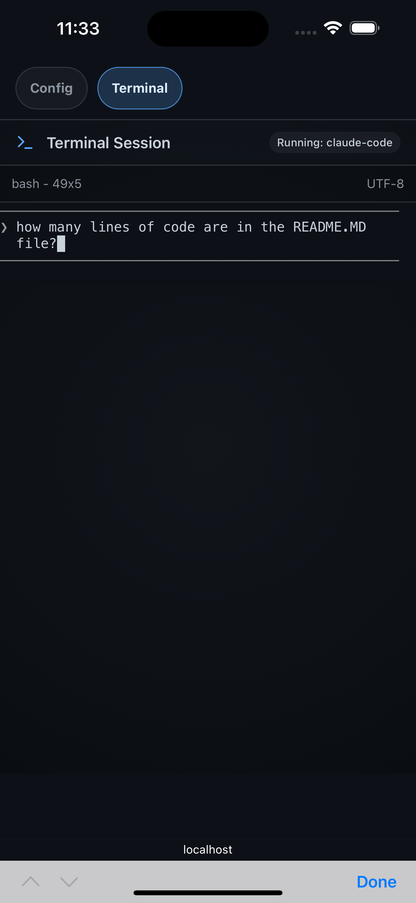

# Claude Code WebUI

A local web interface for running Claude Code in a browser terminal, with optional provider bridging for Ollama and OpenAI-compatible endpoints.

## Application Preview



### Mobile Preview

<p align="center">
  
  
</p>

## For Users

### What You Get

- Browser-based terminal powered by xterm.js
- One-click web terminal session startup
- Session survives browser refresh and reconnects with terminal output restored
- One-click native terminal launch (macOS, Windows, Linux)
- Configurable provider, model, API key, and working directory
- Resizable left config panel with drag handle
- Collapsible config panel with `<` and `>` toggle button
- File-system directory picker from the UI
- Create Folder action inside the Browse dialog to create and auto-select a new directory
- Live terminal resize (no fixed 80x24) with server-side PTY resize sync
- Mobile/iOS-friendly layout with safe-area support
- Mobile tabbed layout with separate Config and Terminal tabs

### Quick Start

1. Run the installer (installs/checks Node.js, npm, Claude CLI, OS-specific native terminal dependencies, project deps, and local cert/config):

macOS/Linux:

```bash
./install.sh
```

Windows PowerShell:

```powershell
powershell -ExecutionPolicy Bypass -File .\install.ps1
```

2. Start frontend and backend:

macOS/Linux or Windows CMD:

```bash
npm run dev
```

Windows PowerShell:

```powershell
npm.cmd run dev
```

3. Open the app:

- http://localhost:5173

### First Run In The UI

1. Select provider: Anthropic, Ollama, or OpenAI-compatible.
2. Enter API key if required by provider.
3. Optionally set Claude Executable Path if `claude` is not available on your PATH.
4. Set base URL when needed.
5. Click Fetch Models and pick a model.
6. Choose a working directory with Browse, or create one directly inside the Browse dialog.
7. On mobile, switch between Config and Terminal using tabs at the top.
8. On desktop, resize or collapse the left config panel using the drag edge and `<`/`>` toggle.
9. Start Web Terminal or Launch in Native Terminal.

### Requirements

- Node.js 18+
- npm
- Local TLS files in server: cert.pem and key.pem
- Claude Code CLI available for terminal startup
- Linux native terminal launch: `x-terminal-emulator` (installer attempts to install provider)

Notes:

- Native launch uses platform-specific terminal opening:
- macOS: Terminal via AppleScript
- Windows: PowerShell window
- Linux: `x-terminal-emulator` fallback
- `CLAUDE_PATH` can be set to override the Claude executable used for launch.
- The WebUI also supports an optional Claude Executable Path field, which overrides the default command for that saved config.

### Common Commands

```bash
npm run dev
npm run dev:server
npm run dev:client
npm run install:all
npm --prefix server run generate:certs
npm run repair:pty
```

Windows PowerShell: prefer `npm.cmd ...` if your execution policy blocks `npm.ps1`.

### Troubleshooting

1. Frontend loads but terminal is disconnected.

- Confirm backend is listening on https://localhost:3001.
- Confirm server cert and key are present.

2. PTY does not start correctly on macOS.

- Run `npm run repair:pty` to repair node-pty helper permissions.
- Restart the server and verify startup logs include `node-pty self-test: OK`.

3. PowerShell blocks `npm` with an execution policy error.

- Use `npm.cmd` instead of `npm`, for example `npm.cmd run dev`.
- For a one-off session, `Set-ExecutionPolicy -Scope Process -ExecutionPolicy Bypass` also works.

4. No models appear.

- Verify provider, base URL, and API key.
- For Ollama, ensure service is running and reachable.

4. Session starts but Claude does not launch.

- Check Claude CLI installation.
- Verify configured or hardcoded Claude path is valid.

5. Native terminal launch fails.

- macOS: confirm Terminal permissions and `osascript` availability.
- Windows: confirm `powershell.exe` is available in PATH.
- Linux: ensure `x-terminal-emulator` is installed, or use the web terminal.

## For Contributors

### Contributing Guide

- See CONTRIBUTING.md for branch workflow, PR expectations, and local development guidance.

### Project Layout

- client: React UI (Vite)
- server: HTTPS API, socket server, PTY lifecycle, protocol bridge
- install.sh / install.ps1: helper installers
- package.json: root orchestration scripts

### Runtime Architecture

- Frontend connects to backend with Socket.IO over HTTPS.
- Backend loads and persists runtime config in server/config.json.
- Starting a session spawns a global PTY shell and relays IO over socket events.
- Refresh/reconnect reattaches to active PTY and replays recent terminal history.
- Auto-start optionally writes claude command into the PTY.
- Anthropic-style messages can be translated to OpenAI chat completions for non-Anthropic providers.

### Key Frontend Files

- client/src/App.jsx: app state, provider/model config, startup actions
- client/src/components/Terminal.jsx: xterm setup and socket relay
- client/src/components/FileBrowser.jsx: directory selection modal using backend FS endpoint

### Key Backend Behaviors

- HTTPS server on port 3001
- Socket events:
- inbound: start-session, stop-session, terminal-input, terminal-resize, terminal-sync-request, update-config
- outbound: config-loaded, session-state, terminal-history, terminal-data, session-closed
- PTY spawn fallback chain:
- node-pty with zsh/bash/sh
- Python PTY fallback if node-pty fails
- Native macOS terminal launch endpoint:
- Native terminal launch endpoint (platform-specific):
- POST /v1/terminal/launch
- File browser endpoint:
- GET /v1/fs/ls?path=...
- Create folder endpoint:
- POST /v1/fs/mkdir

### Provider Bridge

- GET /v1/models
- anthropic: static model list
- ollama: converts base URL to Ollama tags endpoint
- openai-compatible: requests baseUrl/models
- POST /v1/messages
- accepts Anthropic-style payload
- maps messages/tools to OpenAI format
- forwards to baseUrl/chat/completions
- maps normal and streaming responses back to Anthropic-style events
- Ollama provider automatically remaps incoming unsupported `claude-*` model IDs to the configured Ollama model

### Current Security/Posture Caveats

- CORS is open.
- Self-signed TLS with client-side rejectUnauthorized disabled in frontend socket connection.
- NODE_TLS_REJECT_UNAUTHORIZED is set to 0 in spawned session env.
- auto-start and fallback launch currently include dangerously-skip-permissions.

These defaults are convenient for local development but are not production-safe.

### Suggested Next Improvements

1. Replace hardcoded Claude binary path with env/config value.
2. Add optional strict TLS mode.
3. Add production CORS allowlist.
4. Move secrets and defaults into env variables.
5. Add health endpoint and startup checks for cert/key presence.
